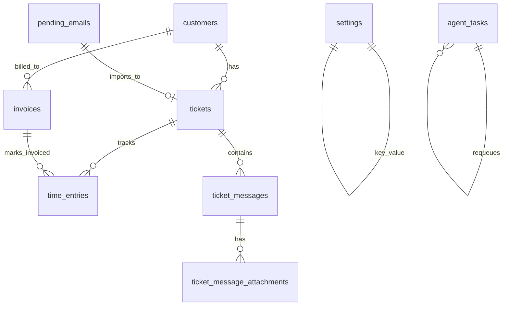

# Schema Notes

The current database is SQLite at `data/hq.db` in development. Migrations live in `server/db/migrations/` and are applied by `server/db/migrate.js`.

## ER diagram



## `customers`

| Column | Type | Null | Default | Notes |
|---|---|---:|---|---|
| id | INTEGER | NO | AUTOINCREMENT | PK |
| name | TEXT | NO | — | Customer/person name |
| email | TEXT | YES | — | Used for matching/imports |
| phone | TEXT | YES | — | May be enriched from Google Contacts after user approval |
| company | TEXT | YES | — | May be enriched from Google Contacts after user approval |
| notes | TEXT | YES | — | May include approved Google Contacts notes/address |
| created_at | TEXT | NO | CURRENT_TIMESTAMP | |
| updated_at | TEXT | YES | — | Updated by edit endpoint |

## `tickets`

| Column | Type | Null | Default | Notes |
|---|---|---:|---|---|
| id | INTEGER | NO | AUTOINCREMENT | PK |
| ticket_uid | TEXT | NO | — | Internal admin reference only (`G-NNNNNN`), never sent to customers |
| customer_id | INTEGER | NO | — | FK → `customers.id` |
| source | TEXT | NO | `manual` | `manual`, `email`, or `booking` |
| source_message_id | TEXT | YES | — | Gmail Message-ID header for imported email requests; used for Gmail thread lookup/archive |
| status | TEXT | NO | `open` | Open/resolved workflow state |
| priority | TEXT | YES | — | Admin priority |
| subject | TEXT | NO | — | Customer-facing emails use original subject, not ticket wording |
| last_message_at | TEXT | YES | — | Ordering/health |
| resolved_at | TEXT | YES | — | Resolution timestamp |
| deleted_at | TEXT | YES | — | Soft-delete timestamp. Set by `DELETE /api/tickets/:id` to hide the ticket from the default list view. Cleared by `POST /api/tickets/:id/restore`. |
| deleted_by | TEXT | YES | — | Actor that issued the soft-delete. Reserved for future multi-user support; currently always `admin`. |

Indexes:

- `idx_tickets_deleted_at (deleted_at) WHERE deleted_at IS NOT NULL` — partial index added in migration 037 to keep the live-list path (`status` filter) cheap.

## `pending_emails`

Migration: `server/db/migrations/008_junk_classification.sql` adds the dismissal/classification fields.

| Column | Type | Null | Default | Notes |
|---|---|---:|---|---|
| id | INTEGER | NO | AUTOINCREMENT | PK |
| message_id | TEXT | NO | — | Unique Gmail Message-ID or UID fallback |
| uid | TEXT | YES | — | Gmail UID |
| from_name | TEXT | YES | — | Sender display name |
| from_email | TEXT | YES | — | Sender email |
| subject | TEXT | YES | — | Email subject |
| body | TEXT | YES | — | Email body/snippet source |
| snippet | TEXT | YES | — | Queue preview |
| received_at | TEXT | YES | — | Email date; list ordering/filtering uses this |
| status | TEXT | NO | `pending` | `pending`, `imported`, or `dismissed` |
| imported_ticket_id | INTEGER | YES | — | FK-ish pointer to created ticket after import |
| fetched_at | TEXT | NO | CURRENT_TIMESTAMP | Scan timestamp |
| decided_at | TEXT | YES | — | Import/dismiss decision timestamp |
| flagged | INTEGER | NO | `0` | Gmail starred/flagged marker |
| dismissed_by | TEXT | YES | — | `user`, `auto_junk`, or `auto_ai` |
| dismissed_reason | TEXT | YES | — | Human-readable rule/AI reason |
| classification | TEXT | YES | — | JSON: `{ score, signals[], should_dismiss, reason, decided_at }` |
| dismissed_at | TEXT | YES | — | Dismiss timestamp |

Indexes:

- `idx_pending_emails_status (status, fetched_at DESC)`
- `idx_pending_emails_msgid (message_id)` unique

Notes:

- Gmail scan parks messages here first. Nothing creates a customer/request until the admin clicks **Import**.
- `include_dismissed=true` exposes dismissed rows for review/restore.
- Auto-dismiss is intentionally strict: existing customers, likely humans, personal replies, calendar invites, and ambiguous messages stay visible.

## `appointments`

| Column | Type | Null | Default | Notes |
|---|---|---:|---|---|
| id | INTEGER | NO | AUTOINCREMENT | PK |
| customer_name | TEXT | NO | — | Public booking form |
| customer_email | TEXT | NO | — | Public booking form |
| starts_at | TEXT | NO | — | Slot start |
| ends_at | TEXT | NO | — | Slot end |
| notes | TEXT | YES | — | Booking notes |
| booking_slug | TEXT | YES | `general` | Public booking page slug |
| status | TEXT | NO | `scheduled` | Non-cancelled rows block future slots |

## `invoices`

| Column | Type | Null | Default | Notes |
|---|---|---:|---|---|
| id | INTEGER | NO | AUTOINCREMENT | PK |
| invoice_uid | TEXT | NO | — | `INV-YYYY-NNN` |
| customer_id | INTEGER | NO | — | FK → `customers.id` |
| line_items | TEXT | NO | — | JSON invoice lines; labour lines may include `source_time_entry_id`, `type: 'labour'`, and integer `total_cents` |
| subtotal_cents | INTEGER | NO | — | Integer cents; uses `line_items[].total_cents` where present |
| tax_cents | INTEGER | NO | — | Integer cents |
| total_cents | INTEGER | NO | — | Integer cents |
| status | TEXT | NO | `draft` | `draft`, `sent`, `viewed`, `overdue`, `partial`, `paid`, `cancelled`. See Phase 3 state machine below. |
| due_at | TEXT | YES | — | Due date |
| notes | TEXT | YES | — | Internal/customer invoice notes |
| sent_at | TEXT | YES | — | Set when emailed |
| paid_at | TEXT | YES | — | First time the invoice's succeeded payments reached `total_cents`. Immutable thereafter (refund demotes status to `partial` but leaves `paid_at` stamped). |
| created_at | TEXT | NO | CURRENT_TIMESTAMP | |

Indexes: `idx_invoices_due_at_partial ON invoices(due_at) WHERE status IN ('sent','viewed','partial')` — added in migration `034_invoice_payment_states.sql` to keep leakage and overdue reports fast.

Notes:

- Minimum charge is not stored as a customer-visible invoice line. When applied, labour line unit prices/totals are privately boosted before invoice creation.
- The floor configuration lives in `settings.minimum_charge_cents`; `0` or missing means disabled.

#### Invoice state machine (Phase 3)

Managed by `reconcileInvoiceStatus()` in `server/routes/accounting.js`. The ledger (`payments`) is the source of truth; the `invoices.status` value is a cached projection. Always re-run the reconciler (or hit the live summary endpoint) if you suspect drift.

```
   draft ──send──▶ sent ──auto──▶ viewed
                          ╲
                           ──auto (success payment total ≥ total_cents)──▶ partial
                                                                              ╲
                                                                                ──auto (paid in full)──▶ paid
                                                                                                          ╲
                                                                                                            ──manual──▶ cancelled / void
                          ╲
                           ──auto (due_at < now AND status IN sent|viewed|partial AND no succeeded payments yet)──▶ overdue
```

Sticky rules:

- `cancelled` is terminal — payments never auto-recover it.
- `partial` is the steady state for any invoice with 0 < succeeded payments < total_cents. A past-due `partial` does NOT auto-promote to `overdue`; the row stays `partial` and `due_at` is the operator's to read.
- `paid` auto-demotes to `partial` if a refund drops `SUM(succeeded) < total_cents`. `paid_at` is preserved as the immutable settlement timestamp.
- `void` is treated as an alias of `cancelled` (same code path in `server/routes/invoices.js`).
- Manual `POST /api/invoices/:id/status` accepts `{draft|sent|viewed|overdue|paid|cancelled}`. `partial` is never set by hand — it is always derived from the ledger.

## `time_entries`

| Column | Type | Null | Default | Notes |
|---|---|---:|---|---|
| id | INTEGER | NO | AUTOINCREMENT | PK |
| ticket_id | INTEGER | NO | — | FK-ish pointer to `tickets.id` |
| started_at | TEXT | NO | — | |
| stopped_at | TEXT | YES | — | Set when timer is finalized/stopped |
| paused_at | TEXT | YES | — | Set while the active timer is paused |
| duration_seconds | INTEGER | YES | `0` for active timers | Accumulated elapsed seconds while paused/running; final elapsed seconds after stop |
| note | TEXT | YES | — | Invoice line description seed |
| invoiced_at | TEXT | YES | — | Set after invoice creation to avoid double billing |

Timer state:

- Active timers have `stopped_at IS NULL`.
- Running timers have `stopped_at IS NULL AND paused_at IS NULL`; elapsed time is `duration_seconds + (now - started_at)`.
- Paused timers have `stopped_at IS NULL AND paused_at IS NOT NULL`; elapsed time is frozen in `duration_seconds`.
- Stopped timers have `stopped_at IS NOT NULL`; `duration_seconds` is the final billable elapsed time.

## `settings`

| Key | Value type | Default | Notes |
|---|---|---|---|
| `business_name` | string | `GeekShop Computers` | Invoice print/email |
| `business_email` | string | `byron@geekshop.ca` | Invoice print/email |
| `booking_slug` | string | `general` | Public booking URL |
| `default_tax_model` | string | `gst_pst_bc` | One of the six Canadian tax models |
| `labour_rate_cents_per_hour` | integer cents | `10000` fallback | Money/time revenue and invoice drafts |
| `minimum_charge_cents` | integer cents | `0` fallback | Private per-invoice floor; only applied when selected/enabled |
| `email_signature` | plain text | (empty) | Plain-text signature appended to every outbound ticket reply (text + escaped HTML). Used when `email_signature_format` is unset/`plain`. |
| `email_signature_format` | `plain` \| `html` | `plain` | Selects signature source: `plain` reads `email_signature`; `html` reads `email_signature_html` and runs it through the allowlist sanitizer before embed. |
| `email_signature_html` | HTML (allowlist-filtered) | (empty) | Rich signature, used when `email_signature_format = 'html'`. Sanitized on send: tag/attribute allowlist only, `javascript:`/`data:` URLs stripped, on* event handlers stripped. |
| `agent_mailbox_from` | CSV | `johnn5wizbot@gmail.com` | From-addresses treated as operational agent traffic |
| `auto_dismiss_domains` | CSV | (empty) | Domains that always count as junk (+0.6 score) |
| `auto_keep_subjects` | CSV | (empty) | Subject substrings that are NEVER auto-dismissed |
| `ai_high_provider` / `ai_cheap_provider` | string | `minimax` | Two-tier AI provider routing |

## `ticket_messages`

| Column | Type | Null | Default | Notes |
|---|---|---|---|---|
| id | INTEGER | NO | AUTOINCREMENT | PK |
| ticket_id | INTEGER | NO | — | FK → `tickets.id` |
| sender | TEXT | NO | — | `admin`, `customer`, or `system` |
| body | TEXT | NO | — | Plain-text body (canonical) |
| body_html | TEXT | YES | — | Sanitized HTML for iframe rendering (cid: → `/api/attachments/:id/raw` already rewritten) |
| subject | TEXT | YES | — | Per-message subject (set for the first message of a thread; used for thread re-creation) |
| gmail_message_id | TEXT | YES | — | Idempotency key — unique index. Used by the reply matcher to detect "already appended" on re-scan. |
| source_message_id | TEXT | YES | — | The Gmail `In-Reply-To` / `References` header that placed this message in the thread. Audit / cross-reference. |
| ai_draft | INTEGER | NO | `0` | 1 if this admin message was an AI-drafted reply |
| created_at | TEXT | NO | CURRENT_TIMESTAMP | |

Indexes:

- `idx_messages_ticket (ticket_id, created_at)`
- `idx_ticket_messages_gmail_msgid` unique (when `gmail_message_id IS NOT NULL`)
- `idx_ticket_messages_source_msgid` (when `source_message_id IS NOT NULL`)

Notes:

- `body_html` is sanitized on write (`sanitizeEmailHtml` in `lib/attachments.js`): strips `<script>`, `<iframe>`, `<object>`, `<embed>`, `<link>`, `on*` handlers, `javascript:` URLs. Renders inside a sandboxed iframe in the UI.
- The reply matcher (`lib/replies.js`) appends new customer messages here when a Gmail message is recognized as a reply to an existing open ticket. The poller and the manual Import button both go through this path.

## `agent_tasks`

Mission Control — durable queue of tasks Byron asks J5 to do. Driven by
the HQ UI (`POST /api/agent-tasks`), the Telegram bridge, and (future)
email. A cron worker (`GeekShop agent task worker`, every 2 min) claims
the next task, runs it through a subagent, self-reviews against
acceptance criteria, and transitions to `review` (all criteria pass) or
`blocked` (some criterion failed). Byron then approves / sends back /
cancels from the Mission Control page or (future) inline Telegram
buttons.

| Column | Type | Null | Default | Notes |
|---|---|---:|---|---|
| id | INTEGER | NO | AUTOINCREMENT | PK |
| uid | TEXT | NO | — | Short stable handle, e.g. `T-AB12CD`. Exposed in the UI and used as the inline-button token. |
| title | TEXT | NO | — | One-line summary shown in the HQ table |
| prompt | TEXT | NO | — | Full ask; the worker session is fresh and gets no other context |
| source | TEXT | NO | `hq_ui` | `hq_ui` \| `telegram` \| `email` \| `voice` \| `seed` |
| source_ref | TEXT | YES | — | Telegram msg id, Gmail id, etc. |
| priority | INTEGER | NO | 0 | Higher = picked first |
| status | TEXT | NO | `queued` | `queued` \| `running` \| `review` \| `blocked` \| `failed` \| `done` \| `cancelled` |
| attempts | INTEGER | NO | 0 | Incremented atomically on each claim |
| max_attempts | INTEGER | NO | 3 | After this many failed runs, the worker transitions the task to `failed` instead of requeueing |
| created_at | TEXT | NO | CURRENT_TIMESTAMP | |
| started_at | TEXT | YES | — | Set on first claim |
| last_heartbeat_at | TEXT | YES | — | Worker writes periodically while running; stuck-detector requeues tasks with stale heartbeats |
| finished_at | TEXT | YES | — | Set on terminal transition |
| last_error | TEXT | YES | — | Exception message on `failed` / `blocked` |
| result_summary | TEXT | YES | — | 1–3 sentence outcome the worker writes before finishing |
| evidence_path | TEXT | YES | — | Filesystem path to evidence (file, screenshot, log) |
| worker_run_id | TEXT | YES | — | Hermes run id that handled it (for audit) |
| acceptance_criteria | TEXT | YES | — | JSON: `[{ req, kind }]` — Byron-supplied contract |
| review_checklist | TEXT | YES | — | JSON: `[{ req, pass, note }]` — the worker's self-review |
| decision | TEXT | YES | — | `approve` \| `requeue` \| `cancel` |
| decided_by | TEXT | YES | — | `byron` (UI button) or `auto` (worker self-rejected) |
| decision_note | TEXT | YES | — | Free text from the human or auto note |
| decided_at | TEXT | YES | — | |

Indexes:

- `idx_agent_tasks_status_priority` `(status, priority DESC, created_at ASC)` partial — covers the worker's hot claim path
- `idx_agent_tasks_running` `(status, last_heartbeat_at)` partial — covers the stuck-detector
- `idx_agent_tasks_created_desc` `(created_at DESC, id DESC)` — HQ default sort
- `idx_agent_tasks_status_created` `(status, created_at DESC)` — history view

Notes:

- Status transitions are state-machine-guarded in `lib/agent-tasks.js::decideTask` — a `done` task can't be re-decided, a `queued` task can't be approved before the worker has run.
- The "open" list filter is `queued|running|review|blocked` — everything that needs eyes.
- The worker prompt is at `server/scripts/agent-task-worker/WORKER_PROMPT.md`; it's the operating manual the worker reads on every cron tick.

## Tax models

Implemented in `server/lib/tax.js`:

- `none`
- `gst`
- `gst_pst_bc`
- `gst_qst_qc`
- `hst_on_13`
- `hst_nb_ns_pe_15`
## Accounting module tables (added in migration 031)

### `tax_rates`
Owner-defined tax rates (GST 5%, PST 7%, HST 13%, custom 0–100%).

| Column | Type | Null | Default | Notes |
|---|---|---|---|---|
| id | INTEGER | NO | AUTO_INCREMENT | PK |
| name | TEXT | NO | — | e.g. 'GST', 'PST', 'HST' |
| rate_bps | INTEGER | NO | — | basis points (5% = 500). Integer, no float drift. |
| is_compound | INTEGER | NO | 0 | reserved for compound-tax models |
| jurisdiction | TEXT | YES | NULL | e.g. 'CA-BC', 'CA-ON' |
| active | INTEGER | NO | 1 | 0/1 |
| created_at | TEXT | NO | CURRENT_TIMESTAMP | |

Indexes: `idx_tax_rates_active (active)`

### `products`
Catalog of goods and services selectable on invoices.

| Column | Type | Null | Default | Notes |
|---|---|---|---|---|
| id | INTEGER | NO | AUTO_INCREMENT | PK |
| sku | TEXT | YES | NULL | UNIQUE — null allowed for non-SKU items |
| name | TEXT | NO | — | |
| description | TEXT | YES | NULL | |
| unit_price_cents | INTEGER | NO | 0 | |
| taxable | INTEGER | NO | 1 | 0/1 |
| default_tax_rate_id | INTEGER | YES | NULL | FK -> tax_rates(id) ON DELETE SET NULL |
| active | INTEGER | NO | 1 | 0/1 |
| created_at | TEXT | NO | CURRENT_TIMESTAMP | |
| updated_at | TEXT | NO | CURRENT_TIMESTAMP | |

Indexes: `idx_products_active (active)`, `idx_products_sku (sku)`

### `expense_categories`

| Column | Type | Null | Default | Notes |
|---|---|---|---|---|
| id | INTEGER | NO | AUTO_INCREMENT | PK |
| name | TEXT | NO | — | UNIQUE |
| tax_rate_id | INTEGER | YES | NULL | FK -> tax_rates(id) ON DELETE SET NULL |
| created_at | TEXT | NO | CURRENT_TIMESTAMP | |

### `expenses`

| Column | Type | Null | Default | Notes |
|---|---|---|---|---|
| id | INTEGER | NO | AUTO_INCREMENT | PK |
| vendor | TEXT | NO | — | |
| expense_date | TEXT | NO | — | YYYY-MM-DD |
| category_id | INTEGER | YES | NULL | FK -> expense_categories(id) ON DELETE SET NULL |
| amount_cents | INTEGER | NO | — | total including tax |
| tax_cents | INTEGER | NO | 0 | |
| tax_rate_id | INTEGER | YES | NULL | FK -> tax_rates(id) ON DELETE SET NULL |
| payment_method | TEXT | NO | 'other' | cash|cheque|e_transfer|card|other |
| business_use | INTEGER | NO | 1 | 0/1 |
| receipt_path | TEXT | YES | NULL | relative path under data/attachments/ |
| notes | TEXT | YES | NULL | |
| created_at | TEXT | NO | CURRENT_TIMESTAMP | |
| updated_at | TEXT | NO | CURRENT_TIMESTAMP | |

Indexes: `idx_expenses_date (expense_date)`, `idx_expenses_category (category_id)`, `idx_expenses_vendor (vendor)`

Notes:
- Migration 035 adds CHECK constraints to ensure `amount_cents >= 0`, `tax_cents >= 0`, and `tax_cents <= amount_cents` at the database level.
- Receipt attachments are stored outside the webroot in `data/attachments/expenses/<id>/` with size and type checks.
- Supported receipt types: image/png, image/jpeg, image/webp, application/pdf with content sniffing for security.

### `payments`
One row per payment event against an invoice. Stripe + manual both land here.

| Column | Type | Null | Default | Notes |
|---|---|---|---|---|
| id | INTEGER | NO | AUTO_INCREMENT | PK |
| invoice_id | INTEGER | NO | — | FK -> invoices(id) ON DELETE CASCADE |
| amount_cents | INTEGER | NO | — | |
| method | TEXT | NO | — | stripe|cash|cheque|e_transfer|other |
| stripe_payment_intent_id | TEXT | YES | NULL | null for non-Stripe |
| stripe_charge_id | TEXT | YES | NULL | |
| status | TEXT | NO | 'succeeded' | pending|succeeded|failed|refunded |
| received_at | TEXT | NO | CURRENT_TIMESTAMP | |
| notes | TEXT | YES | NULL | |
| created_at | TEXT | NO | CURRENT_TIMESTAMP | |

Indexes: `idx_payments_invoice (invoice_id)`, `idx_payments_stripe_pi (stripe_payment_intent_id)`, `idx_payments_received (received_at)`

### `payment_events`
Append-only event log; one row per Stripe webhook OR manual entry. Idempotency key is `stripe_event_id` (UNIQUE), so the same Stripe event id can never be processed twice.

| Column | Type | Null | Default | Notes |
|---|---|---|---|---|
| id | INTEGER | NO | AUTO_INCREMENT | PK |
| stripe_event_id | TEXT | YES | NULL | UNIQUE — e.g. `evt_...` or `pi:pi_...` for manual |
| source | TEXT | NO | — | stripe|manual |
| event_type | TEXT | NO | — | payment_intent.succeeded | manual.cash | ... |
| invoice_id | INTEGER | YES | NULL | FK -> invoices(id) ON DELETE SET NULL |
| payment_id | INTEGER | YES | NULL | FK -> payments(id) ON DELETE SET NULL |
| payload | TEXT | YES | NULL | JSON blob |
| processed_at | TEXT | NO | CURRENT_TIMESTAMP | |

Indexes: `idx_payment_events_invoice (invoice_id)`, `idx_payment_events_type (event_type)`

## Tax summary reports (Phase 5)

The tax summary reports functionality uses existing tables and adds no new schema. The implementation leverages:

- `invoices` table for tax collected data (using `tax_cents` and `tax_lines` columns)
- `expenses` table for tax paid data (using `tax_cents` and `tax_rate_id` columns)
- `tax_rates` table for tax rate information

The reports are generated by the following endpoints:
- `GET /api/accounting/tax/summary` - Provides date-range GST/PST/HST reports for tax collected on invoices/payments and tax paid on expenses, producing net remittance summary
- `GET /api/accounting/tax/pdf-ready` - Provides PDF-ready payload for tax remittance summary

All values are integer cents and tax model behavior is consistent with existing accounting functionality.

## Contract Clients module tables (migration 033)

Replaces the Google Sheets "Contract Clients" workbook. Designed to live
alongside the existing `customers` / `tickets` tables — corporate contract
clients are distinct from one-off paying customers. Requests are a
separate concept (`contract_requests`) from the existing `tickets` table
because they have a different SLA and a different billing path (covered by
the monthly contract, not invoiced per-ticket). The `editable_after_submission`
seam is reserved (see `contract_requests.editable_until`) but disabled in
v1 — schema/API keep the future-edit feature cheap to add without an ALTER.

### `contract_clients`

Corporate entity that holds the monthly support contract.

| Column | Type | Null | Default | Notes |
|---|---|---|---|---|
| id | INTEGER | NO | AUTO_INCREMENT | PK |
| name | TEXT | NO | — | e.g. 'Acme Holdings' |
| status | TEXT | NO | 'active' | active \| archived |
| primary_contact_name | TEXT | YES | NULL | |
| primary_contact_email | TEXT | YES | NULL | |
| phone | TEXT | YES | NULL | |
| billing_address | TEXT | YES | NULL | |
| notes | TEXT | YES | NULL | |
| created_at | TEXT | NO | CURRENT_TIMESTAMP | |
| updated_at | TEXT | YES | NULL | |

Indexes: `idx_contract_clients_status (status)`, `idx_contract_clients_name (name)`

### `contract_locations`

Offices / branches under a contract client.

| Column | Type | Null | Default | Notes |
|---|---|---|---|---|
| id | INTEGER | NO | AUTO_INCREMENT | PK |
| client_id | INTEGER | NO | — | FK -> contract_clients(id) ON DELETE CASCADE |
| label | TEXT | NO | — | e.g. 'Vancouver HQ' |
| address | TEXT | YES | NULL | |
| city | TEXT | YES | NULL | |
| region | TEXT | YES | NULL | |
| postal_code | TEXT | YES | NULL | |
| timezone | TEXT | YES | NULL | IANA tz string |
| notes | TEXT | YES | NULL | |
| status | TEXT | NO | 'active' | active \| archived |
| created_at | TEXT | NO | CURRENT_TIMESTAMP | |

Indexes: `idx_contract_locations_client (client_id, status)`

### `client_contacts`

People attached to a specific location. Multiple per location. An
"office manager" (`is_office_manager = 1`) is the typical portal user.

| Column | Type | Null | Default | Notes |
|---|---|---|---|---|
| id | INTEGER | NO | AUTO_INCREMENT | PK |
| location_id | INTEGER | NO | — | FK -> contract_locations(id) ON DELETE CASCADE |
| client_id | INTEGER | NO | — | FK -> contract_clients(id) ON DELETE CASCADE |
| name | TEXT | NO | — | |
| email | TEXT | YES | NULL | |
| phone | TEXT | YES | NULL | |
| role | TEXT | YES | NULL | free-text, e.g. 'Office Manager' |
| is_office_manager | INTEGER | NO | 0 | 1 = office manager (scoped to location) |
| notify_on_request | INTEGER | NO | 1 | email notify on request state changes |
| status | TEXT | NO | 'active' | |
| created_at | TEXT | NO | CURRENT_TIMESTAMP | |

Indexes: `idx_client_contacts_location (location_id)`, `idx_client_contacts_email (email)`

### `client_portal_credentials`

One row per authorized portal login. Password stored as a Node `scrypt`
hash (built-in, no native deps). Lives separately from `sessions` so
portal auth failures are isolated from admin auth failures and audit
trails don't cross.

| Column | Type | Null | Default | Notes |
|---|---|---|---|---|
| id | INTEGER | NO | AUTO_INCREMENT | PK |
| email | TEXT | NO | — | UNIQUE — login identity |
| password_hash | TEXT | NO | — | `scrypt$<saltHex>$<derivedHex>` |
| display_name | TEXT | NO | — | shown in the portal nav |
| contact_id | INTEGER | YES | NULL | FK -> client_contacts(id) ON DELETE SET NULL — which contact this credential represents |
| client_id | INTEGER | NO | — | FK -> contract_clients(id) ON DELETE CASCADE |
| scope_type | TEXT | NO | 'location_manager' | `client_manager` \| `location_manager` |
| scoped_location_ids | TEXT | YES | NULL | JSON array of location ids; NULL = all locations on the client |
| last_login_at | TEXT | YES | NULL | |
| disabled_at | TEXT | YES | NULL | soft-disable without delete |
| created_at | TEXT | NO | CURRENT_TIMESTAMP | |

Indexes: `idx_client_portal_creds_client (client_id)`, `idx_client_portal_creds_contact (contact_id)`

### `client_portal_sessions`

Server-side portal sessions. Cookie name `hq_csid` (48 hex chars).
Mirrors `sessions` but is isolated to the portal: an admin session
cookie (`hq_sid`) cannot read portal data, and a portal cookie cannot
read admin data.

| Column | Type | Null | Default | Notes |
|---|---|---|---|---|
| id | TEXT | NO | — | PK — 48-hex cookie value |
| credential_id | INTEGER | NO | — | FK -> client_portal_credentials(id) ON DELETE CASCADE |
| client_id | INTEGER | NO | — | FK -> contract_clients(id) ON DELETE CASCADE |
| expires_at | TEXT | NO | — | 14 days |
| created_at | TEXT | NO | CURRENT_TIMESTAMP | |

Indexes: `idx_client_portal_sessions_cred (credential_id)`

### `client_invites`

One-time magic-link tokens used to onboard a new portal user. Admin
generates the token, shares the URL manually for now (email delivery
is a future seam). 7-day TTL; first redemption creates the credential.

| Column | Type | Null | Default | Notes |
|---|---|---|---|---|
| token | TEXT | NO | — | PK — 32-hex |
| email | TEXT | NO | — | |
| client_id | INTEGER | NO | — | FK -> contract_clients(id) ON DELETE CASCADE |
| scope_type | TEXT | NO | 'location_manager' | |
| scoped_location_ids | TEXT | YES | NULL | JSON array |
| display_name | TEXT | YES | NULL | |
| contact_id | INTEGER | YES | NULL | FK -> client_contacts(id) ON DELETE SET NULL |
| invited_by | TEXT | NO | 'admin' | |
| expires_at | TEXT | NO | — | 7-day default |
| consumed_at | TEXT | YES | NULL | set when redeemed |
| created_at | TEXT | NO | CURRENT_TIMESTAMP | |

Indexes: `idx_client_invites_email (email)`

### `client_assets`

Computer/device inventory at a specific location. Manual entry only in
v1; future scope includes agent-collected inventory + change events.

| Column | Type | Null | Default | Notes |
|---|---|---|---|---|
| id | INTEGER | NO | AUTO_INCREMENT | PK |
| client_id | INTEGER | NO | — | FK -> contract_clients(id) ON DELETE CASCADE |
| location_id | INTEGER | NO | — | FK -> contract_locations(id) ON DELETE CASCADE |
| hostname | TEXT | YES | NULL | e.g. ACME-LAPTOP-04 |
| asset_tag | TEXT | YES | NULL | |
| assigned_user | TEXT | YES | NULL | |
| type | TEXT | NO | — | laptop \| desktop \| server \| printer \| network \| other |
| manufacturer | TEXT | YES | NULL | |
| model | TEXT | YES | NULL | |
| serial | TEXT | YES | NULL | |
| os | TEXT | YES | NULL | |
| cpu | TEXT | YES | NULL | |
| ram_gb | INTEGER | YES | NULL | |
| storage_gb | INTEGER | YES | NULL | |
| warranty_until | TEXT | YES | NULL | ISO date |
| last_serviced_at | TEXT | YES | NULL | ISO date |
| status | TEXT | NO | 'active' | active \| retired \| decommissioned |
| notes | TEXT | YES | NULL | |
| created_at | TEXT | NO | CURRENT_TIMESTAMP | |
| updated_at | TEXT | YES | NULL | |

Indexes: `idx_client_assets_location (location_id, status)`, `idx_client_assets_client (client_id)`, `idx_client_assets_hostname (hostname)`

### `contract_requests`

A request/task submitted by a contract contact (or by admin on their
behalf), optionally tied to a specific asset at a specific location.
Status transitions: `open → in_progress → resolved`. `cancelled` is a
terminal state with its own `cancelled_at/by/reason` columns.

| Column | Type | Null | Default | Notes |
|---|---|---|---|---|
| id | INTEGER | NO | AUTO_INCREMENT | PK |
| request_uid | TEXT | NO | — | e.g. `CR-000123`; UNIQUE |
| client_id | INTEGER | NO | — | FK -> contract_clients(id) ON DELETE CASCADE |
| location_id | INTEGER | NO | — | FK -> contract_locations(id) ON DELETE CASCADE |
| submitting_contact_id | INTEGER | NO | — | FK -> client_contacts(id) ON DELETE RESTRICT |
| asset_id | INTEGER | YES | NULL | FK -> client_assets(id) ON DELETE SET NULL |
| subject | TEXT | NO | — | |
| description | TEXT | NO | — | |
| category | TEXT | YES | NULL | hardware \| software \| network \| account \| other |
| priority | TEXT | NO | 'normal' | low \| normal \| high \| urgent |
| status | TEXT | NO | 'open' | open \| in_progress \| resolved \| cancelled |
| assigned_to | TEXT | YES | NULL | admin/tech initials |
| resolved_at | TEXT | YES | NULL | |
| cancelled_at | TEXT | YES | NULL | |
| cancelled_by | TEXT | YES | NULL | 'contact' \| 'admin' \| 'system' |
| cancel_reason | TEXT | YES | NULL | |
| editable_until | TEXT | YES | NULL | NULL = no edits in v1; future seam |
| created_at | TEXT | NO | CURRENT_TIMESTAMP | |
| updated_at | TEXT | YES | NULL | |

Indexes: `idx_contract_requests_uid (request_uid) UNIQUE`, `idx_contract_requests_client_status (client_id, status, created_at DESC)`, `idx_contract_requests_location_status (location_id, status)`, `idx_contract_requests_asset (asset_id)`

### `contract_request_events`

Append-only event log per request. Admin UI can replay history; portal
UI shows the same history scoped to the viewer.

| Column | Type | Null | Default | Notes |
|---|---|---|---|---|
| id | INTEGER | NO | AUTO_INCREMENT | PK |
| request_id | INTEGER | NO | — | FK -> contract_requests(id) ON DELETE CASCADE |
| actor | TEXT | NO | — | 'admin' \| 'contact:<id>' \| 'system' |
| event_type | TEXT | NO | — | created \| status_change \| cancelled \| edited \| assigned |
| from_status | TEXT | YES | NULL | |
| to_status | TEXT | YES | NULL | |
| note | TEXT | YES | NULL | |
| created_at | TEXT | NO | CURRENT_TIMESTAMP | |

Indexes: `idx_contract_request_events_req (request_id, created_at)`

### `client_portal_audit`

Portal-side audit log. Kept separate from `audit_log` because audit_log
is admin-only — clients should not see admin actions on their data, and
admins should not see portal-specific events in their general view.

| Column | Type | Null | Default | Notes |
|---|---|---|---|---|
| id | INTEGER | NO | AUTO_INCREMENT | PK |
| credential_id | INTEGER | YES | NULL | FK -> client_portal_credentials(id) ON DELETE SET NULL |
| client_id | INTEGER | YES | NULL | FK -> contract_clients(id) ON DELETE SET NULL |
| action | TEXT | NO | — | login.ok / login.failed / request.create / request.cancel / invite.redeem |
| target | TEXT | YES | NULL | e.g. `req:42` |
| ip | TEXT | YES | NULL | |
| created_at | TEXT | NO | CURRENT_TIMESTAMP | |

Indexes: `idx_client_portal_audit_client (client_id, created_at DESC)`

## Derived views (no new tables)

The schema is intentionally additive — most HQ features compose rows from the
tables above without introducing new schema. The accounting-roadmap phases
document which existing tables each phase reads.

### Customer 360 timeline (Phase 2 — `GET /customers/:id/timeline`)

No DB additions. The endpoint runs eight small SELECTs against existing
tables and merges them into one time-ordered event stream. Tables touched:

- `customers` — header (name/email/status), used for the email-fallback
  appointment match
- `tickets` — `ticket_created` + `ticket_resolved` events
- `ticket_messages` (joined to `tickets`) — `ticket_message` events
- `appointments` — by `customer_id` or case-folded email fallback
- `time_entries` (joined to `tickets`) — `time_entry` events, runs `running: true`
  when `stopped_at IS NULL`
- `invoices` — `invoice` events; `created_at`, `sent_at`, `paid_at` each emit
  one event row so a paid invoice shows as three dots in chronological order
- `payments` (joined to `invoices`) — `payment` events; `stripe_payment_intent_id`
  and `stripe_charge_id` are explicitly **not** projected
- `customer_memory` (added in a pre-existing migration along with
  `tax_rates` / `payments`) — `memory` events for both `manual` and
  `ai` sources; `confidence < 1` rows render as low-confidence badges

Privacy contract enforced at the SELECT level: `body_html`, `gmail_message_id`,
`source_message_id`, `stripe_payment_intent_id`, and `stripe_charge_id` are
never named in any of the eight queries.
