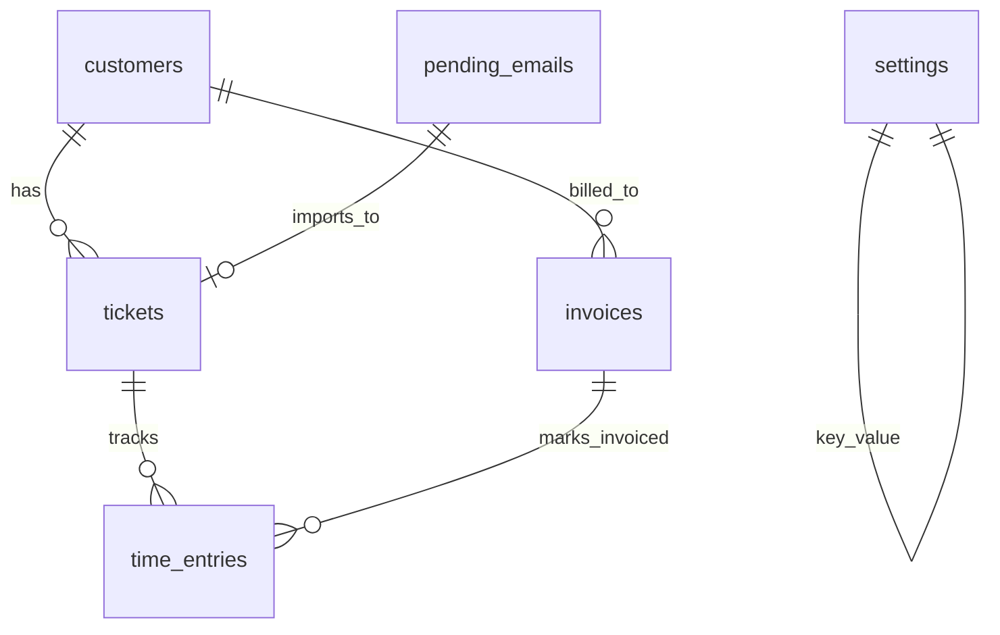

# Schema Notes

The current database is SQLite at `data/hq.db` in development. Migrations live in `server/db/migrations/` and are applied by `server/db/migrate.js`.

## ER diagram

## `customers`

| Column | Type | Null | Default | Notes |
|---|---|---:|---|---|
| id | INTEGER | NO | AUTOINCREMENT | PK |
| name | TEXT | NO | — | Customer/person name |
| email | TEXT | YES | — | Used for matching/imports |
| phone | TEXT | YES | — | May be enriched from Google Contacts after user approval |
| company | TEXT | YES | — | May be enriched from Google Contacts after user approval |
| notes | TEXT | YES | — | May include approved Google Contacts notes/address |
| created_at | TEXT | NO | CURRENT_TIMESTAMP | |
| updated_at | TEXT | YES | — | Updated by edit endpoint |

## `tickets`

| Column | Type | Null | Default | Notes |
|---|---|---:|---|---|
| id | INTEGER | NO | AUTOINCREMENT | PK |
| ticket_uid | TEXT | NO | — | Internal admin reference only (`G-NNNNNN`), never sent to customers |
| customer_id | INTEGER | NO | — | FK → `customers.id` |
| source | TEXT | NO | `manual` | `manual`, `email`, or `booking` |
| source_message_id | TEXT | YES | — | Gmail Message-ID header for imported email requests; used for Gmail thread lookup/archive |
| status | TEXT | NO | `open` | Open/resolved workflow state |
| priority | TEXT | YES | — | Admin priority |
| subject | TEXT | NO | — | Customer-facing emails use original subject, not ticket wording |
| last_message_at | TEXT | YES | — | Ordering/health |
| resolved_at | TEXT | YES | — | Resolution timestamp |

## `pending_emails`

Migration: `server/db/migrations/008_junk_classification.sql` adds the dismissal/classification fields.

| Column | Type | Null | Default | Notes |
|---|---|---:|---|---|
| id | INTEGER | NO | AUTOINCREMENT | PK |
| message_id | TEXT | NO | — | Unique Gmail Message-ID or UID fallback |
| uid | TEXT | YES | — | Gmail UID |
| from_name | TEXT | YES | — | Sender display name |
| from_email | TEXT | YES | — | Sender email |
| subject | TEXT | YES | — | Email subject |
| body | TEXT | YES | — | Email body/snippet source |
| snippet | TEXT | YES | — | Queue preview |
| received_at | TEXT | YES | — | Email date; list ordering/filtering uses this |
| status | TEXT | NO | `pending` | `pending`, `imported`, or `dismissed` |
| imported_ticket_id | INTEGER | YES | — | FK-ish pointer to created ticket after import |
| fetched_at | TEXT | NO | CURRENT_TIMESTAMP | Scan timestamp |
| decided_at | TEXT | YES | — | Import/dismiss decision timestamp |
| flagged | INTEGER | NO | `0` | Gmail starred/flagged marker |
| dismissed_by | TEXT | YES | — | `user`, `auto_junk`, or `auto_ai` |
| dismissed_reason | TEXT | YES | — | Human-readable rule/AI reason |
| classification | TEXT | YES | — | JSON: `{ score, signals[], should_dismiss, reason, decided_at }` |
| dismissed_at | TEXT | YES | — | Dismiss timestamp |

Indexes:

- `idx_pending_emails_status (status, fetched_at DESC)`
- `idx_pending_emails_msgid (message_id)` unique

Notes:

- Gmail scan parks messages here first. Nothing creates a customer/request until the admin clicks **Import**.
- `include_dismissed=true` exposes dismissed rows for review/restore.
- Auto-dismiss is intentionally strict: existing customers, likely humans, personal replies, calendar invites, and ambiguous messages stay visible.

## `appointments`

| Column | Type | Null | Default | Notes |
|---|---|---:|---|---|
| id | INTEGER | NO | AUTOINCREMENT | PK |
| customer_name | TEXT | NO | — | Public booking form |
| customer_email | TEXT | NO | — | Public booking form |
| starts_at | TEXT | NO | — | Slot start |
| ends_at | TEXT | NO | — | Slot end |
| notes | TEXT | YES | — | Booking notes |
| booking_slug | TEXT | YES | `general` | Public booking page slug |
| status | TEXT | NO | `scheduled` | Non-cancelled rows block future slots |

## `invoices`

| Column | Type | Null | Default | Notes |
|---|---|---:|---|---|
| id | INTEGER | NO | AUTOINCREMENT | PK |
| invoice_uid | TEXT | NO | — | `INV-YYYY-NNN` |
| customer_id | INTEGER | NO | — | FK → `customers.id` |
| line_items | TEXT | NO | — | JSON invoice lines; labour lines may include `source_time_entry_id`, `type: 'labour'`, and integer `total_cents` |
| subtotal_cents | INTEGER | NO | — | Integer cents; uses `line_items[].total_cents` where present |
| tax_cents | INTEGER | NO | — | Integer cents |
| total_cents | INTEGER | NO | — | Integer cents |
| status | TEXT | NO | `draft` | `draft`, `sent`, `paid`, `overdue` |
| due_at | TEXT | YES | — | Due date |
| notes | TEXT | YES | — | Internal/customer invoice notes |
| sent_at | TEXT | YES | — | Set when emailed |
| paid_at | TEXT | YES | — | Set by manual mark-paid; future QBO sync should own this |
| created_at | TEXT | NO | CURRENT_TIMESTAMP | |

Notes:

- Minimum charge is not stored as a customer-visible invoice line. When applied, labour line unit prices/totals are privately boosted before invoice creation.
- The floor configuration lives in `settings.minimum_charge_cents`; `0` or missing means disabled.

## `time_entries`

| Column | Type | Null | Default | Notes |
|---|---|---:|---|---|
| id | INTEGER | NO | AUTOINCREMENT | PK |
| ticket_id | INTEGER | NO | — | FK-ish pointer to `tickets.id` |
| started_at | TEXT | NO | — | |
| stopped_at | TEXT | YES | — | Null while running |
| duration_seconds | INTEGER | YES | — | Used for invoice drafts |
| note | TEXT | YES | — | Invoice line description seed |
| invoiced_at | TEXT | YES | — | Set after invoice creation to avoid double billing |

## `settings`

| Key | Value type | Default | Notes |
|---|---|---|---|
| `business_name` | string | `GeekShop Computers` | Invoice print/email |
| `business_email` | string | `byron@geekshop.ca` | Invoice print/email |
| `booking_slug` | string | `general` | Public booking URL |
| `default_tax_model` | string | `gst_pst_bc` | One of the six Canadian tax models |
| `labour_rate_cents_per_hour` | integer cents | `10000` fallback | Money/time revenue and invoice drafts |
| `minimum_charge_cents` | integer cents | `0` fallback | Private per-invoice floor; only applied when selected/enabled |

## Tax models

Implemented in `server/lib/tax.js`:

- `none`
- `gst`
- `gst_pst_bc`
- `gst_qst_qc`
- `hst_on_13`
- `hst_nb_ns_pe_15`
